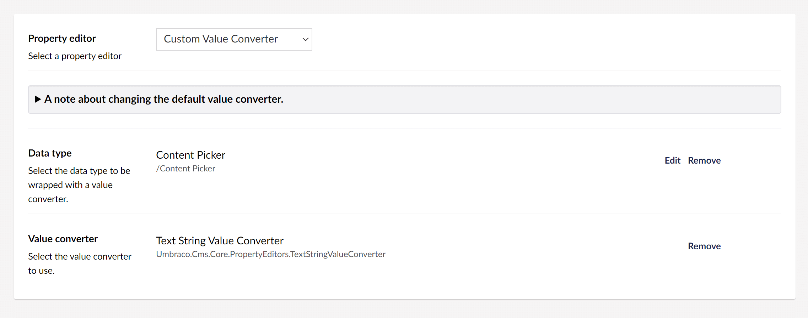

## Custom Value Converter for Umbraco

A wrapper property-editor (for Umbraco) that lets you pick a custom/alternative `ValueConverter` for a specified data-type.

### What does that mean?

Let's say that you have a property that is using a Content Picker editor, when you come to use the property on the frontend of the website, say with ModelsBuilder, the value's object-type would be an `IPublishedContent`. However, if you wanted to only use the raw value, e.g. a `string` of the Content's UDI, then your options are to either make an additional call to `value.GetUdi()`, or use a Custom Value Converter - to swap the default Content Picker value converter with a plain-text value converter.

In terms of ModelsBuilder, this would change the property's object-type from an `IPublishedContent` to a `string`.

This is just one example, many more advanced combinations could be achieved.

### Installation

_**Please note,**_ currently you can only install a package from the [NuGet package repository](https://www.nuget.org/packages/Our.Umbraco.Community.CustomValueConverter).

    dotnet add package Our.Umbraco.Community.CustomValueConverter

### License

Copyright &copy; [Lee Kelleher](https://leekelleher.com).

All source code is licensed under the [Mozilla Public License](../LICENSE).

#### Logo

The package logo uses the [Replace](https://thenounproject.com/icon/replace-212135/) icon (by [Arthur Shlain](https://thenounproject.com/ArtZ91/)) icon from the [Noun Project](https://thenounproject.com), licensed under [CC BY 3.0 US](https://creativecommons.org/licenses/by/3.0/us/).
